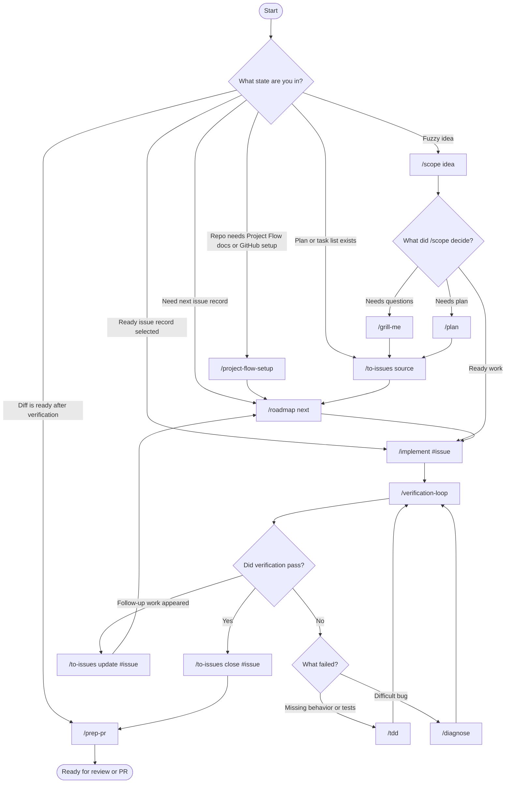
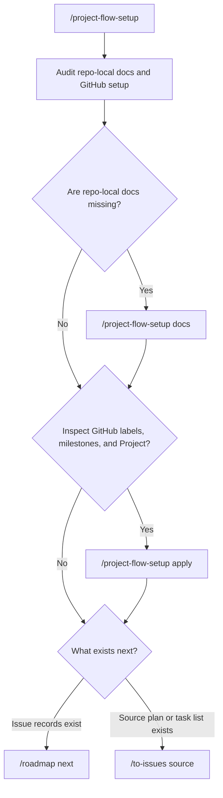
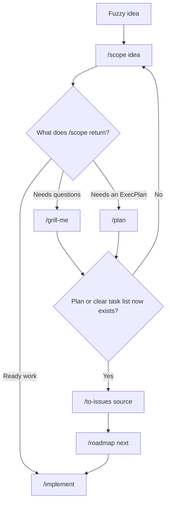
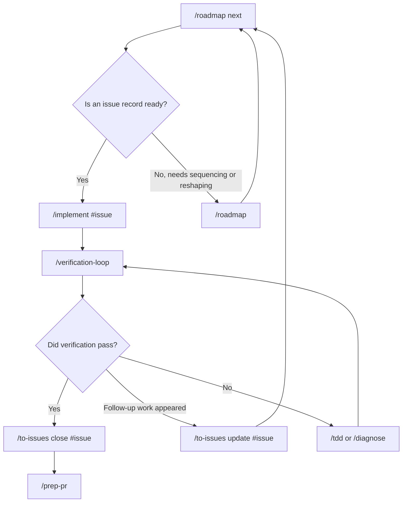

# Project Flow How-To

This guide explains how the project-management and development workflow fits together with `/project-flow-setup`.

## The Skill Boundary

- `/project-flow-setup` configures a repository for the workflow.
- `/to-issues` creates, updates, and closes issue records.
- `/roadmap` chooses, prioritizes, sequences, and reshapes work.
- `/scope` decides whether to implement, plan, or grill.
- `/implement` implements selected ready work.
- `/verification-loop` proves the work.
- `/prep-pr` packages the final diff for review or PR.

## Visual Decision Trees

Use the decision trees when you know the project state but not the next Skill.
The editable source is [project-flow-decision-trees.yaml](./project-flow-decision-trees.yaml).

### Project Flow Router



### First-Time Setup Tree



### New Work Tree



### Daily Work Tree



## First-Time Setup

In a GitHub-backed project repo, run:

```text
/project-flow-setup
```

With no subcommand, the Skill walks you through the setup in order:

1. Audit the repo for existing project-flow docs and GitHub setup.
2. Show what is missing and what it recommends.
3. Ask whether to write repo-local docs.
4. Ask whether to inspect GitHub labels, milestones, and Projects.
5. Propose GitHub changes.
6. Wait for approval before mutating GitHub.
7. End with the next useful workflow command, usually `/roadmap next` or `/to-issues <source>`.

Use subcommands when you want to jump to one phase:

```text
/project-flow-setup audit
/project-flow-setup docs
/project-flow-setup apply
```

`audit` inspects and reports only. `docs` writes or updates repo-local docs. `apply` proposes GitHub setup changes and asks before running them.

## Repo-Local Docs

The setup Skill creates or updates these files in the target project:

```text
docs/agents/project-flow.md
docs/agents/issue-tracker.md
docs/agents/triage-labels.md
```

Those docs become the repo-local source of truth for `/to-issues` and `/roadmap`.

## New Work

For a fuzzy idea:

```text
/scope "I want to add saved views to the builder"
```

Then choose:

```text
/grill-me
/plan
/implement
```

Once the work has a plan or clear task list:

```text
/to-issues feature_requests/saved-views-plan.md
```

That creates issue records or sub-issues.

## Daily Work

Start with:

```text
/roadmap next
```

It reads issues, milestones, Project status, blockers, and priority, then recommends the next issue record.

Then run:

```text
/implement #123
/verification-loop
```

If verification passes:

```text
/to-issues close #123
```

If follow-up work appears:

```text
/to-issues update #123 "Add follow-up slice for sharing saved views"
```

## PR Prep

When the diff is ready for review:

```text
/prep-pr
```

Use this after verification and issue-record updates. It packages the diff, verification evidence, risks, and PR text.

## Common Loops

Daily loop:

```text
/roadmap next
/implement #issue
/verification-loop
/to-issues close #issue
/prep-pr
```

Fuzzy-work loop:

```text
/scope idea
/grill-me or /plan
/to-issues plan
/roadmap next
```

Repo setup loop:

```text
/project-flow-setup
/roadmap next
```

## GitHub Shape

Use GitHub this way:

- Issues are issue records.
- Sub-issues break parent work into Vertical Slices.
- Milestones are goal or release buckets.
- Projects are the Kanban/status/priority Surface.
- Labels are taxonomy, not the main priority system.

Recommended Project fields:

```text
Status: Inbox, Backlog, Ready, In Progress, Blocked, Review, Done
Priority: P0, P1, P2, P3
Size: XS, S, M, L
Mode: AFK, HITL
```

## Default Invocation Contract

Bare `/project-flow-setup` is the guided path. It does not require the user to know the subcommands first.

Subcommands should remain available for direct control:

- `/project-flow-setup audit` for read-only inspection.
- `/project-flow-setup docs` for repo-local docs.
- `/project-flow-setup apply` for approval-gated GitHub setup.
