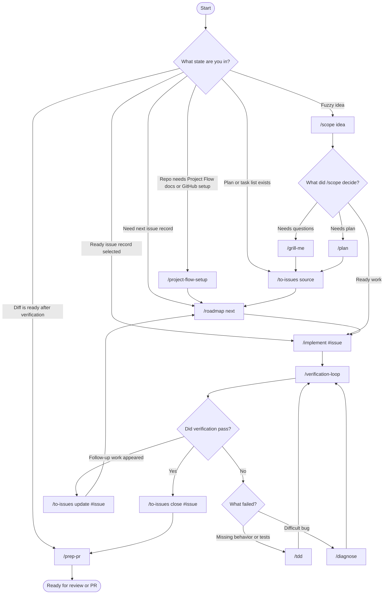
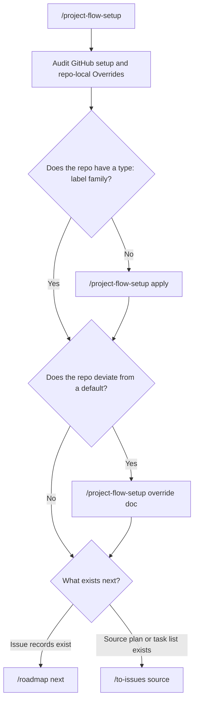
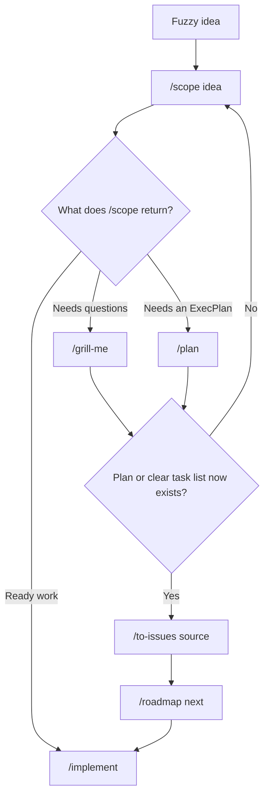
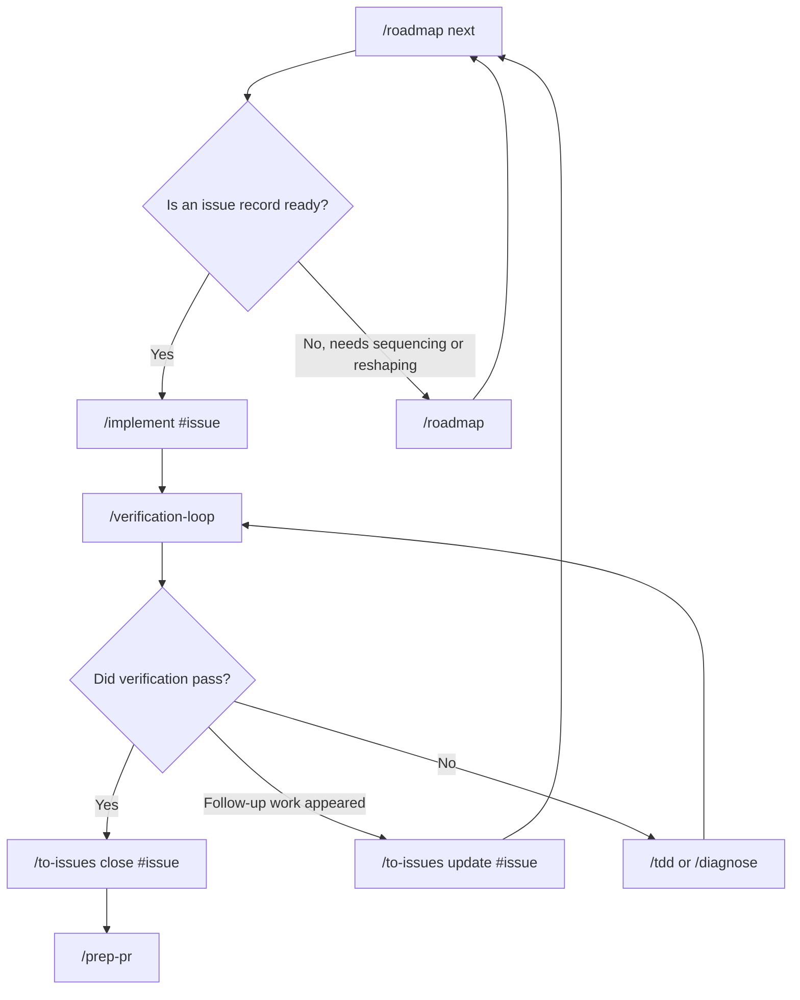

# Project Flow How-To

This guide explains how the project-management and development workflow fits together with `/project-flow-setup`.

## The Skill Boundary

- `/project-flow-setup` configures a repository for the workflow.
- `/to-issues` creates, updates, and closes issue records.
- `/roadmap` chooses, prioritizes, sequences, and reshapes work.
- `/scope` decides whether to implement, plan, or grill.
- `/implement` implements selected ready work.
- `/verification-loop` proves the work.
- `/prep-pr` packages the final diff for review or PR.

## Visual Decision Trees

Use the decision trees when you know the project state but not the next Skill.
The editable source is [project-flow-decision-trees.yaml](./project-flow-decision-trees.yaml).

### Project Flow Router


```mermaid
flowchart TD
  router_start([Start]) --> router_state{What state are you in?}
  router_state -->|Repo needs Project Flow docs or GitHub setup| setup["/project-flow-setup"]
  router_state -->|Fuzzy idea| scope["/scope idea"]
  router_state -->|Plan or task list exists| to_issues["/to-issues source"]
  router_state -->|Need next issue record| roadmap["/roadmap next"]
  router_state -->|Ready issue record selected| execute["/implement #issue"]
  router_state -->|Diff is ready after verification| prep_pr["/prep-pr"]

  setup --> roadmap
  scope --> scope_result{What did /scope decide?}
  scope_result -->|Needs questions| grill["/grill-me"]
  scope_result -->|Needs plan| plan["/plan"]
  scope_result -->|Ready work| execute
  grill --> to_issues
  plan --> to_issues
  to_issues --> roadmap
  roadmap --> execute
  execute --> verify["/verification-loop"]
  verify --> verified{Did verification pass?}
  verified -->|Yes| close_issue["/to-issues close #issue"]
  verified -->|Follow-up work appeared| update_issue["/to-issues update #issue"]
  verified -->|No| fix_forward{What failed?}
  fix_forward -->|Missing behavior or tests| tdd["/tdd"]
  fix_forward -->|Difficult bug| diagnose["/diagnose"]
  tdd --> verify
  diagnose --> verify
  update_issue --> roadmap
  close_issue --> prep_pr
  prep_pr --> done([Ready for review or PR])

  click setup "#first-time-setup" "Jump to First-Time Setup"
  click scope "#new-work" "Jump to New Work"
  click roadmap "#daily-work" "Jump to Daily Work"
  click prep_pr "#pr-prep" "Jump to PR Prep"
```

### First-Time Setup Tree


```mermaid
flowchart TD
  setup_start["/project-flow-setup"] --> audit["Audit GitHub setup and repo-local Overrides"]
  audit --> labels_missing{"Does the repo have a type: label family?"}
  labels_missing -->|No| apply_skill["/project-flow-setup apply"]
  labels_missing -->|Yes| deviates{Does the repo deviate from a default?}
  apply_skill --> deviates
  deviates -->|Yes| override_skill["/project-flow-setup override doc"]
  deviates -->|No| next_command{What exists next?}
  override_skill --> next_command
  next_command -->|Issue records exist| setup_roadmap["/roadmap next"]
  next_command -->|Source plan or task list exists| setup_to_issues["/to-issues source"]
```

### New Work Tree


```mermaid
flowchart TD
  idea["Fuzzy idea"] --> scope_skill["/scope idea"]
  scope_skill --> scope_choice{What does /scope return?}
  scope_choice -->|Needs questions| grill_skill["/grill-me"]
  scope_choice -->|Needs an ExecPlan| plan_skill["/plan"]
  scope_choice -->|Ready work| execute_skill["/implement"]
  grill_skill --> shaped{Plan or clear task list now exists?}
  plan_skill --> shaped
  shaped -->|Yes| issues_skill["/to-issues source"]
  shaped -->|No| scope_skill
  issues_skill --> next_issue["/roadmap next"]
  next_issue --> execute_skill
```

### Daily Work Tree


```mermaid
flowchart TD
  daily_start["/roadmap next"] --> issue_ready{Is an issue record ready?}
  issue_ready -->|Yes| daily_execute["/implement #issue"]
  issue_ready -->|No, needs sequencing or reshaping| daily_roadmap["/roadmap"]
  daily_roadmap --> daily_start
  daily_execute --> daily_verify["/verification-loop"]
  daily_verify --> daily_result{Did verification pass?}
  daily_result -->|Yes| daily_close["/to-issues close #issue"]
  daily_result -->|Follow-up work appeared| daily_update["/to-issues update #issue"]
  daily_result -->|No| daily_fix["/tdd or /diagnose"]
  daily_fix --> daily_verify
  daily_update --> daily_start
  daily_close --> daily_prep["/prep-pr"]
```

## First-Time Setup

In a GitHub-backed project repo, run:

```text
/project-flow-setup
```

With no subcommand, the Skill runs the setup to completion:

1. Audit the repo for GitHub setup and any repo-local Overrides.
2. Show what is missing.
3. Inspect GitHub labels, milestones, and Projects.
4. Create the missing labels, milestones, and Project fields — setup is plumbing, so it does not stop to ask.
5. Report what was done, and list anything only you can run under `Needs you:`.
6. End with the next useful workflow command, usually `/roadmap next` or `/to-issues <source>`.

It writes no files into your repo.

Use subcommands when you want to jump to one phase:

```text
/project-flow-setup audit
/project-flow-setup apply
/project-flow-setup override <doc>
```

`audit` inspects and reports only. `apply` runs the GitHub setup. `override` copies one bundled default into `docs/agents/` so the repo can deviate from it.

## The Contract lives in defaults, not in your repo

The workflow Contract is three docs bundled with the Skill:

```text
~/.claude/skills/project-flow-setup/defaults/project-flow.md
~/.claude/skills/project-flow-setup/defaults/issue-tracker.md
~/.claude/skills/project-flow-setup/defaults/triage-labels.md
```

`/to-issues` and `/roadmap` read them from there. **A repo that follows the default workflow needs no copy of them** — a copy is duplication that silently desyncs the next time a default changes.

Write a repo-local file only when the repo actually deviates:

```text
/project-flow-setup override issue-tracker
```

That writes `docs/agents/issue-tracker.md` as an **Override**. It shadows the default of the same name completely, and from then on it stops tracking upstream changes to that default. Edit it to describe how this repo differs.

The signal that a repo was never set up is the absence of a `type:` label family, not a missing doc. `/to-issues` and `/roadmap` check `gh label list` and run setup inline when they find none.

## New Work

For a fuzzy idea:

```text
/scope "I want to add saved views to the builder"
```

Then choose:

```text
/grill-me
/plan
/implement
```

Once the work has a plan or clear task list:

```text
/to-issues .tasks/saved-views/plan.md
```

That creates issue records or sub-issues.

## Daily Work

Start with:

```text
/roadmap next
```

It reads issues, milestones, Project status, blockers, and priority, then recommends the next issue record.

Then run:

```text
/implement #123
/verification-loop
```

If verification passes:

```text
/to-issues close #123
```

If follow-up work appears:

```text
/to-issues update #123 "Add follow-up slice for sharing saved views"
```

## PR Prep

When the diff is ready for review:

```text
/prep-pr
```

Use this after verification and issue-record updates. It packages the diff, verification evidence, risks, and PR text.

## Common Loops

Daily loop:

```text
/roadmap next
/implement #issue
/verification-loop
/to-issues close #issue
/prep-pr
```

Fuzzy-work loop:

```text
/scope idea
/grill-me or /plan
/to-issues plan
/roadmap next
```

Repo setup loop:

```text
/project-flow-setup
/roadmap next
```

## GitHub Shape

Use GitHub this way:

- Issues are issue records.
- Sub-issues break parent work into Vertical Slices.
- Milestones are goal or release buckets.
- Projects are the Kanban/status/priority Surface.
- Labels are taxonomy, not the main priority system.

Recommended Project fields:

```text
Status: Inbox, Backlog, Ready, In Progress, Blocked, Review, Done
Priority: P0, P1, P2, P3
Size: XS, S, M, L
Mode: AFK, HITL
```

## Default Invocation Contract

Bare `/project-flow-setup` is the guided path. It does not require the user to know the subcommands first.

Subcommands should remain available for direct control:

- `/project-flow-setup audit` for read-only inspection.
- `/project-flow-setup apply` for GitHub setup.
- `/project-flow-setup override <doc>` to write a repo-local Override of one bundled default.
